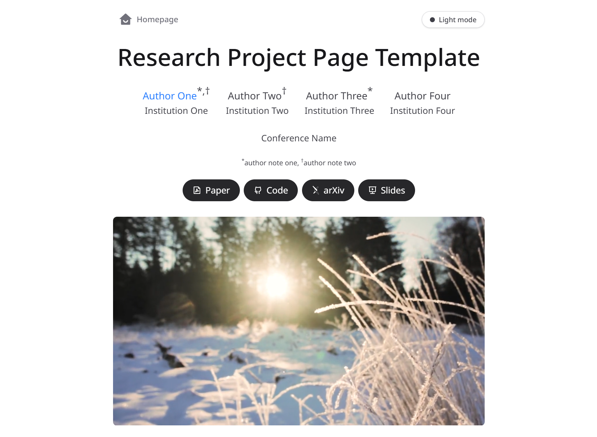

# Research Project Blog Template

    

        
    

    

        <a href="https://awni00.github.io/research-blog-template" target="_blank" rel="noopener" style="display:inline-block;padding:0.6rem 1rem;background:#0ea5a4;color:#fff;border-radius:8px;text-decoration:none;font-weight:600">Demo</a>
    

This repo implements a template for building blog-style webpages for academic research projects. It is designed to be easy to use by using [Astro]("a JavaScript web framework optimized for building fast, content-driven websites"). I.e., you can build your webpage by writing the *content* in markdown, without having to worry so much about HTML/CSS.

The original repo is based on [the following project by Roman Hauuksson](https://github.com/RomanHauksson/academic-project-astro-template), which traces back to [this project page by Keunhong Park](https://nerfies.github.io/). As I was using these templates to build my project pages, I ended up implementing some new features for things I wanted to add. This repo serves as my own customized version of the template with some additional features, which I plan to continue using for future projects. I'm making it public as well in case it is helpful to anyone else building academic blogs. Feel free to 

## Features

The following features implemented by the [original project by Roman Hauksson](https://github.com/RomanHauksson/academic-project-astro-template)
- Easily edit the content in Markdown instead of HTML.
- Quick-to-load, works with mobile devices, accessible, SEO-friendly, and supports dark mode.
- Includes out-of-the-box components for figures, LaTeX, code blocks (with syntax highlighting), videos, 3D objects, and a figure comparison slider.
- Add custom components using HTML or even other web frameworks like React, Vue, or Svelte.
- Built with [Astro](https://astro.build/), [React](https://react.dev/), [Tailwind CSS](https://tailwindcss.com/), [MDX](https://mdxjs.com/), and [TypeScript](https://www.typescriptlang.org/).

Below are some additional features I implemented for my version. 
- A table of contents component. Each section header now also has a "link back ↩" icon that takes you back to the table of contents for easier navigation. 
- Footnotes now have a hover feature so you can preview the footnote without having to click it and go to the bottom of the page.
- `MathBlock` component that displays a nice highlighted colored box which can be used to display mathematical definitions or theorems, for theoretical work. Of course, it can also be used to just highlight something.
- More explicit support for defining latex macros, so you can use the same macros in your markdown index file as your original latex paper.
- A header with a link to your homepage and a theme toggle (so that the user can toggle between light and dark themes). 

If you use this theme and end up adding more features, please feel free to share them either by reaching out or via a pull request :)

## Usage

1. Click "Use this template" to make a copy of this repository in your GitHub account.
2. Clone your repository.
3. [Install Node.js](https://nodejs.org/en/download/package-manager) if you haven't already. Make sure you're using version 24 or later, which you can check by running `node --version`. To manage versions, you can use [Node Version Manager](https://github.com/nvm-sh/nvm): `nvm install 24 && nvm use 24`.
4. Run `npm install` from the root of the project to install the dependencies.
5. Edit the content in `/src/pages/index.mdx`. You should use [Visual Studio Code](https://code.visualstudio.com/) – or one of its forks, like [Cursor](https://cursor.com/) – so you can take advantage of the extensions I recommend in `.vscode/extensions.json`.
6. Run `npm run dev` to start the development server, then open `http://localhost:4321` in your browser to see a live preview of your page while you edit it.
7. To deploy your site to the web, you need to enable GitHub Pages for the GitHub repository. Click on the **Settings** tab, then go to **Pages** (under the **Code and automation** section). Using the dropdown, change **Source** from "Deploy from a branch" to "GitHub Actions".
8. Whenever you push to the `main` branch, the GitHub Actions workflow in `.github/workflows/astro.yml` will automatically build and deploy your site to `https://<username>.github.io/<repository>/`. No other configuration is necessary!

For more documentation, consult [`./documentation.md`](./documentation.md).

## Credits

These are some projects that this code borrows from.

- https://github.com/RomanHauksson/academic-project-astro-template
- https://github.com/eliahuhorwitz/Academic-project-page-template
- https://nerfies.github.io/

It's licensed under a [Creative Commons Attribution-ShareAlike 4.0 International License](http://creativecommons.org/licenses/by-sa/4.0/).
